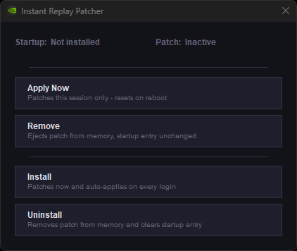
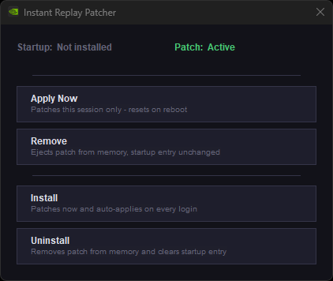
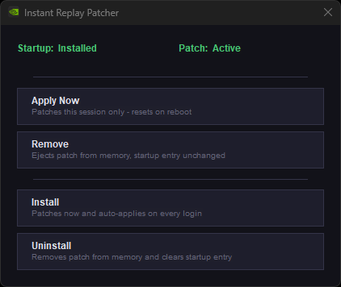

# IRPatcher

Keeps NVIDIA Instant Replay always on for the new **NVIDIA App** (replaces the old GeForce Experience).

Injects a hook DLL into `nvcontainer.exe` to patch the checks that disable Instant Replay.

> This tool exists for one reason — never missing a good clip. We do not condone piracy, DRM bypass, or recording of any protected media; use it responsibly and only for capturing your own gameplay.

## How it works

`hook.dll` is injected into the `nvcontainer.exe` (SPUser instance) and applies three patches:

1. **`GetWindowDisplayAffinity` hook** — always returns `WDA_NONE`, preventing overlay detection from disabling recording.
2. **`Module32FirstW` hook** — always returns `FALSE`, hiding process enumeration used to detect conflicting software.
3. **`nvd3dumx.dll` byte patch** — patches the Widevine L1 capability flag check that disables Instant Replay on protected content.

## Screenshots

| Everything off | Patch applied (session only) | Installed |
|:-:|:-:|:-:|
|  |  |  |

## Usage

Run `IRPatcher.exe` as **Administrator**.

| Button | Effect |
|--------|--------|
| Apply Now | Injects the patch for this session only — resets on reboot |
| Remove | Ejects the patch from memory |
| Install | Injects now and registers a scheduled task to auto-apply on every login |
| Uninstall | Removes the patch from memory and deletes the startup task |

## Building

**Requirements:**
- Visual Studio with MSVC (x64)
- [Microsoft Detours](https://github.com/microsoft/detours) — clone into a `Detours/` folder next to the source files and build it

```
git clone https://github.com/microsoft/detours Detours
cd Detours && nmake
cd ..
```

Then open a **Visual Studio x64 Developer Command Prompt** (as Administrator) and run:

```
build.bat
```

This produces `IRPatcher.exe`.

## Credits

- [furyzenblade/ShadowPlay_Patcher](https://github.com/furyzenblade/ShadowPlay_Patcher) — for the binaries
- [womblee/instant_replay_patcher](https://github.com/womblee/instant_replay_patcher) — for the binaries

## Notes

- **Instant Replay must be turned on and actively recording before applying the patch.** The patch targets the process that runs while recording is active — if Instant Replay is off or not yet running, the injection will have nothing to hook.
- Tested on Windows 11 with NVIDIA App.
- The patch is applied in-memory and does not modify any files on disk.
- The scheduled task runs the patcher at login with highest privileges so the injection works without a UAC prompt each time.
